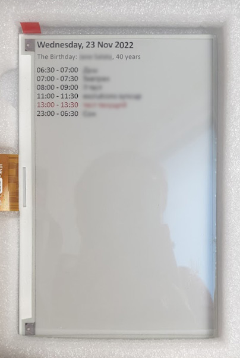

# Sample of working with Waveshare 7.5" e-Paper display

Here is a sample of drawing the events from Google Calendar on the two-colored e-Paper display.

The active event is highlighted in red color. The events are sorted by the start time.\
Also, there is additional information about birthdays and holidays from the third-party API.

Here is the sample of the output:\

There are no libs included in the repository. Same for the code to get events.

The code is written for Python 3.7 and Raspberry Pi.
